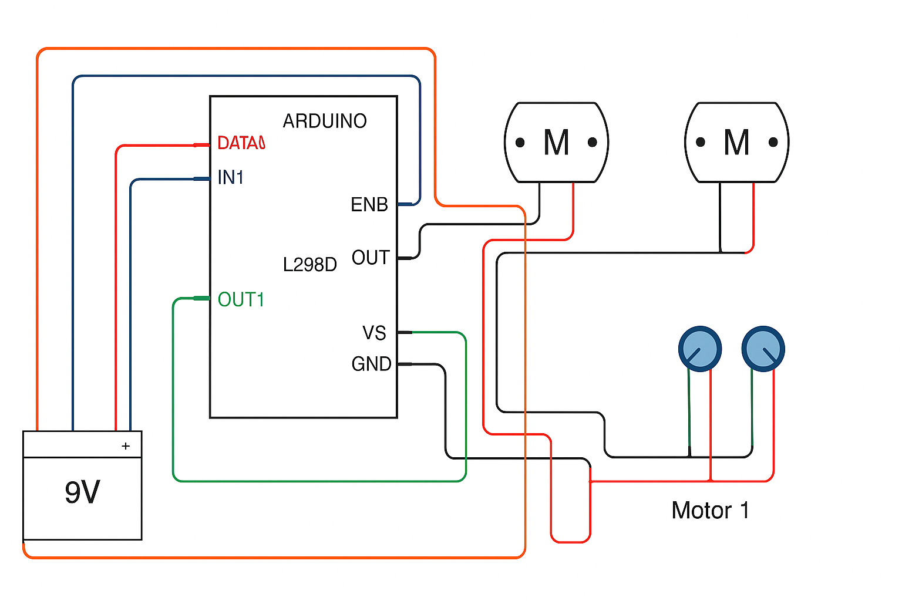

# electrical-synchro-transmitter-model
"Arduino-based simulation of synchro transmitter and receiver for position tracking"
# Synchro Transmitter–Receiver System using Arduino

This project simulates a Synchro Transmitter and Receiver system using Arduino in TinkerCAD.  
It mimics how the angular position from a transmitter can control a receiver — like in aircraft instruments.

---

## 🧠 Working Principle

- A **potentiometer** acts as the **Synchro Transmitter**, generating an analog voltage representing angle.
- Arduino reads this analog input.
- The value is mapped and sent to control a **servo motor**, which acts like the **Synchro Receiver**.
- Thus, the servo mimics the potentiometer’s rotation — a basic Synchro simulation.

---

## ⚙️ Components Used

- Arduino UNO
- 2 × Potentiometers (1 for input, optional 2nd for testing)
- 1 × Servo Motor (for receiver)
- L293D Motor Driver (if using motors instead of servo)
- Breadboard, jumper wires
- 9V Battery (external power source)
- TinkerCAD for simulation

---

## 🔌 Circuit Diagram

---

## 🧾 Arduino Code

// Define motor control pins
int motor1IN1 = 9;
int motor1IN2 = 10;
int motor2IN1 = 11;
int motor2IN2 = 12;

// Define enable pins for L293D
int enable1 = 5;  // Enable pin for motor 1
int enable2 = 6;  // Enable pin for motor 2

// Define potentiometer pins
int pot1Pin = A0;
int pot2Pin = A1;

void setup() {
  // Set motor control pins as output
  pinMode(motor1IN1, OUTPUT);
  pinMode(motor1IN2, OUTPUT);
  pinMode(motor2IN1, OUTPUT);
  pinMode(motor2IN2, OUTPUT);
  
  // Set enable pins as output
  pinMode(enable1, OUTPUT);
  pinMode(enable2, OUTPUT);
  
  // Start with motors disabled
  analogWrite(enable1, 0);
  analogWrite(enable2, 0);
  
  // Begin Serial Communication for debugging
  Serial.begin(9600);
}

void loop() {
  // Read the potentiometer values (0 to 1023)
  int pot1Value = analogRead(pot1Pin);
  int pot2Value = analogRead(pot2Pin);
  
  // Map potentiometer values to PWM (0 to 255) for motor speed
  int motor1Speed = map(pot1Value, 0, 1023, 0, 255);
  int motor2Speed = map(pot2Value, 0, 1023, 0, 255);
  
  // Print potentiometer values to Serial Monitor for debugging
  Serial.print("Pot1: ");
  Serial.print(pot1Value);
  Serial.print(" Motor1 Speed: ");
  Serial.println(motor1Speed);
  
  Serial.print("Pot2: ");
  Serial.print(pot2Value);
  Serial.print(" Motor2 Speed: ");
  Serial.println(motor2Speed);

  // Control Motor 1 (based on pot1)
  if (pot1Value < 512) {
    // Rotate Motor 1 clockwise
    digitalWrite(motor1IN1, HIGH);
    digitalWrite(motor1IN2, LOW);
    analogWrite(enable1, motor1Speed);
  } else {
    // Rotate Motor 1 anticlockwise
    digitalWrite(motor1IN1, LOW);
    digitalWrite(motor1IN2, HIGH);
    analogWrite(enable1, motor1Speed);
  }

  // Control Motor 2 (based on pot2)
  if (pot2Value < 512) {
    // Rotate Motor 2 clockwise
    digitalWrite(motor2IN1, HIGH);
    digitalWrite(motor2IN2, LOW);
    analogWrite(enable2, motor2Speed);
  } else {
    // Rotate Motor 2 anticlockwise
    digitalWrite(motor2IN1, LOW);
    digitalWrite(motor2IN2, HIGH);
    analogWrite(enable2, motor2Speed);
  }

  delay(100);  // Small delay to stabilize the loop
}

## 🎯 Applications

- Aircraft instruments
- Naval control systems
- Analog position control
- Simulated electromechanical systems

---

> ⚠️ Note: This is a **simulation model**, not a real synchro system (which uses AC and sine/cosine voltage signals).  
This version mimics the concept using simple analog input + PWM control.
